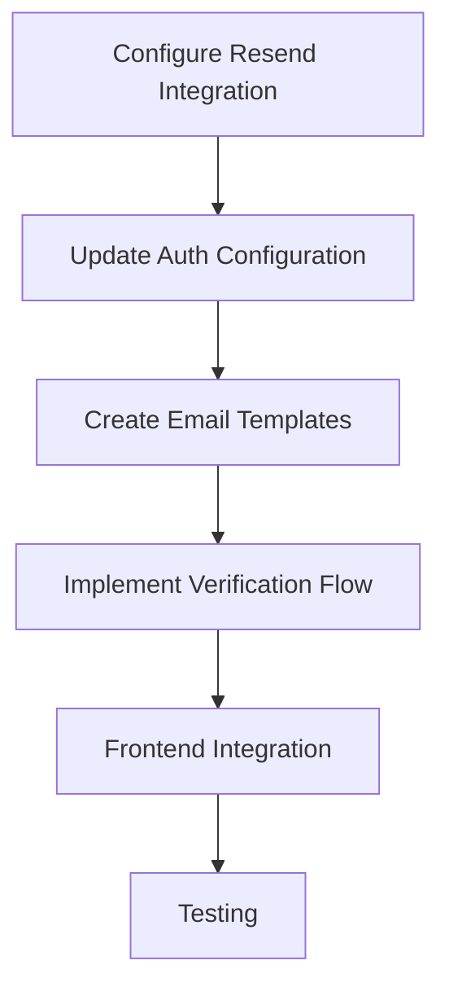

# Authentication Implementation Plan

## 1. Project Context
- **Current Auth Setup**: Google OAuth via better-auth
- **Database Schema**: Supports email/password authentication
- **Email Service**: Resend integrated with API key in `.env`
- **File**: `lib/auth.ts` needs modification

## 2. Implementation Objectives
- Add password-based email authentication
- Implement email verification flow
- Maintain existing Google OAuth integration
- Use Resend for email delivery

## 3. Implementation Steps



### 3.1 Configure Resend Integration
- Add required environment variables to `.env`:
  ```env
  RESEND_API_KEY=your_api_key
  EMAIL_FROM=no-reply@yourdomain.com
  AUTH_VERIFICATION_URL=http://localhost:3000/api/auth/verify
  ```

### 3.2 Update Auth Configuration (`lib/auth.ts`)
```ts
import { betterAuth } from "better-auth";

export const auth = betterAuth({
  socialProviders: {
    google: { 
      clientId: process.env.GOOGLE_CLIENT_ID as string, 
      clientSecret: process.env.GOOGLE_CLIENT_SECRET as string, 
    },
  },
  email: {
    provider: 'resend',
    apiKey: process.env.RESEND_API_KEY,
    from: process.env.EMAIL_FROM,
    templates: {
      verification: 'verification-template-id',
      passwordReset: 'password-reset-template-id'
    },
    passwordHashing: {
      algorithm: 'bcrypt',
      cost: 12
    }
  },
  verification: {
    callbackUrl: process.env.AUTH_VERIFICATION_URL
  }
});
```

### 3.3 Create Email Templates in Resend
- Design templates in Resend dashboard:
  - **Verification Email**:
    - Subject: "Verify your email"
    - Body: Includes `{{verificationUrl}}` placeholder
  - **Password Reset**:
    - Subject: "Reset your password"
    - Body: Includes `{{resetUrl}}` placeholder

### 3.4 Implement Verification Flow
- Create API endpoint at `/api/auth/verify`:
  ```ts
  // api/auth/verify.ts
  import { auth } from '@/lib/auth';
  
  export const POST = auth.handleVerification();
  ```
- Add verification token handling to database schema (already exists)

### 3.5 Frontend Integration
- Create login form with email/password fields
- Add "Forgot password" flow
- Implement verification status display in user profile
- Update signup flow to include email verification step

### 3.6 Testing Strategy
1. Unit tests for:
   - Email/password authentication
   - Token verification
   - Password hashing
2. Integration tests:
   - Full authentication flow
   - Email delivery simulation
3. End-to-end tests:
   - User registration → Verification → Login
   - Password reset flow

## 4. Dependencies
```bash
npm install bcrypt resend
```

## 5. Risk Mitigation
- Backup `lib/auth.ts` before modifications
- Test in staging environment first
- Monitor email delivery metrics in Resend dashboard